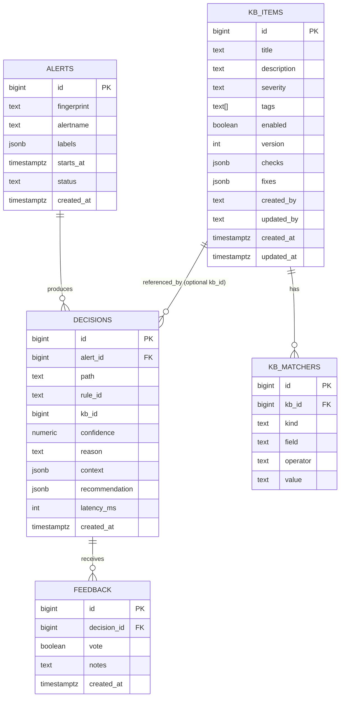

# Phylaxor — Base de datos (PostgreSQL)

Este documento describe **cómo está diseñada** y **para qué se usa** la base de datos de Phylaxor.

> Origen del modelo: `phylaxor_schema.sql` (dump de PostgreSQL).

---

## 1) Principios de diseño

### 1.1 Trazabilidad y aprendizaje
La base de datos existe para poder responder preguntas como:

- “¿Qué hicimos las últimas veces que vimos este mismo problema?”
- “¿Qué reglas de la KB están dando buen resultado?”
- “¿Qué recomendación se envió exactamente, con qué contexto, y qué feedback recibió?”

### 1.2 Simplicidad y flexibilidad
El modelo mezcla:

- **Relaciones simples** (FKs claras entre alerta/decisión/feedback).
- **JSONB** para los bloques que evolucionan rápido (contexto enriquecido, recomendaciones, checks/fixes), evitando tener que migrar la BD por cada cambio de formato.

### 1.3 Append-first
En la práctica, el modelo favorece insertar nuevas filas (histórico) en lugar de editar o borrar. Esto facilita análisis posterior y evita perder trazas.

---

## 2) Diagrama de relaciones



Notas:
- `decisions.alert_id` referencia a `alerts.id`.
- `feedback.decision_id` referencia a `decisions.id`.
- `kb_matchers.kb_id` referencia a `kb_items.id` y tiene **ON DELETE CASCADE** (si borras una KB, se borran sus matchers).
- `decisions.kb_id` es **opcional**: solo se rellena si la decisión viene de una KB.

---

## 3) Tablas

### 3.1 `alerts`
Representa una **instancia** de alerta recibida y normalizada.

Campos:
- `id` (bigint, PK): id interno.
- `fingerprint` (text): identificador estable de Alertmanager (o equivalente). Útil para agrupar “la misma” alerta.
- `alertname` (text): nombre humano/técnico de la alerta.
- `labels` (jsonb): etiquetas asociadas (namespace, pod, cluster, team, etc.).
- `starts_at` (timestamptz): cuándo empezó (según el productor).
- `status` (text): estado (por ejemplo: `firing`, `resolved`, etc.).
- `created_at` (timestamptz, default `now()`): cuándo se persistió.

Intención:
- Ser el punto de anclaje para decisiones e histórico.
- Mantener el payload “flexible” con `labels` en JSONB.

---

### 3.2 `kb_items`
Una entrada de la **Knowledge Base**: describe un problema y cómo diagnosticarlo/mitigarlo.

Campos:
- `id` (bigint, PK)
- `title` (text, NOT NULL): título corto.
- `description` (text): explicación más larga.
- `severity` (text, default `medium`): severidad **validada** por constraint.
  - Valores permitidos: `low`, `medium`, `high`, `critical`.
- `tags` (text[], default `{}`): etiquetas para filtrar/categorizar.
- `enabled` (boolean, default `true`): permite apagar reglas sin borrarlas.
- `version` (int, default `1`): versión manual del contenido.
- `checks` (jsonb, default `[]`): lista de verificaciones/diagnósticos.
- `fixes` (jsonb, default `[]`): lista de acciones de mitigación/fix.
- `created_by`, `updated_by` (text): audit sencillo.
- `created_at`, `updated_at` (timestamptz, default `now()`): timestamps.

Intención:
- `checks` y `fixes` se guardan como arrays JSONB para iterar rápidamente en el formato de las recomendaciones.
- La **lógica de matching** NO vive aquí; vive en `kb_matchers`.

---

### 3.3 `kb_matchers`
Conjunto de condiciones que deben cumplirse para que un `kb_item` aplique.

Campos:
- `id` (bigint, PK)
- `kb_id` (bigint, NOT NULL, FK -> `kb_items.id`, ON DELETE CASCADE)
- `kind` (text, NOT NULL): tipo de matcher (validado por constraint).
  - Permitidos: `alertname`, `namespace`, `label`, `regex`.
- `field` (text, nullable): campo extra cuando `kind = label` (por ejemplo, nombre de la label).
- `operator` (text, NOT NULL): operador (validado por constraint).
  - Permitidos: `eq`, `contains`, `regex`.
- `value` (text, NOT NULL): valor a comparar.

Semántica sugerida (convención):
- `kind=alertname`: se compara contra `alerts.alertname`.
- `kind=namespace`: se compara contra `labels->>'namespace'` (o donde se almacene el namespace).
- `kind=label`: se compara contra `labels->>field`.
- `kind=regex`: se aplica un regex sobre un campo decidido por la app (por ejemplo alertname o una label).

Regla de evaluación recomendada:
- Para una KB concreta, **todos sus matchers** se consideran en AND.
- A nivel de motor de decisión, se pueden evaluar KBs en un orden (por ejemplo por severidad, por tasa de éxito, etc.).

---

### 3.4 `decisions`
Registro de “qué decidió Phylaxor” para una alerta (con suficiente detalle para reproducir y auditar).

Campos:
- `id` (bigint, PK)
- `alert_id` (bigint, FK -> `alerts.id`): qué alerta originó la decisión.
- `path` (text): ruta tomada por el motor (ej.: `history`, `kb`, `fallback`, …). *No está validado por constraint, se controla a nivel de app.*
- `rule_id` (text): identificador textual de la regla aplicada.
  - Convención común: `kb:<id>` si viene de KB, u otro esquema si viene de histórico.
- `kb_id` (bigint, nullable): id de KB usada (si aplica).
- `confidence` (numeric(5,2), nullable): confianza 0–100 (o 0–1 escalado, según convención). La precisión permite valores tipo `100.00`.
- `reason` (text, nullable): explicación corta del porqué.
- `context` (jsonb, nullable): snapshot del contexto enriquecido usado (pods, events, logs, cluster info, etc.).
- `recommendation` (jsonb, nullable): recomendación generada (estructura libre, pero consistente a nivel de app).
- `latency_ms` (int, nullable): latencia de decisión.
- `created_at` (timestamptz, default `now()`): cuándo se insertó.

Intención:
- Guardar **exactamente** lo que salió del motor (recomendación + contexto) para:
  - debugging,
  - auditoría,
  - re-evaluación,
  - métricas y tuning.

---

### 3.5 `feedback`
Feedback humano sobre una decisión enviada.

Campos:
- `id` (bigint, PK)
- `decision_id` (bigint, FK -> `decisions.id`)
- `vote` (boolean): pulgar arriba/abajo.
- `notes` (text): explicación opcional.
- `created_at` (timestamptz, default `now()`)

Índice:
- `idx_feedback_decision_id` en `feedback(decision_id)` para acelerar joins y agregaciones.

---

## 4) Vistas (Views)

### 4.1 `decisions_with_feedback`
Vista pensada para analítica rápida:
- Join de `decisions` con `kb_items` (por `kb_id`) y con `feedback` (por `decision_id`).
- Permite ver en una sola consulta: decisión + KB asociada + feedback.

Campos relevantes:
- `decision_id`, `alert_id`, `kb_id`, `kb_title`, `path`, `rule_id`, `confidence`, `reason`, `created_at`...
- `feedback_id`, `vote`, `notes`, `feedback_created_at`.

### 4.2 `kb_stats`
Vista agregada por KB:
- Cuenta el total de feedback recibido (vía decisiones que referencian esa KB).
- Calcula:
  - `upvotes`
  - `downvotes`
  - `success_rate` (% de upvotes), con redondeo a 2 decimales.

Esto es útil para:
- priorizar KBs buenas,
- detectar KBs malas o desactualizadas,
- decidir si conviene deshabilitar o revisar una KB.

---

## 5) Consultas útiles (para debugging / analítica)

> Nota: los ejemplos asumen que el namespace vive en `alerts.labels->>'namespace'`. Si tu payload usa otra key, ajusta.

### 5.1 Últimas decisiones para un fingerprint
```sql
SELECT a.fingerprint, a.alertname, d.id AS decision_id, d.path, d.rule_id, d.kb_id,
       d.confidence, d.reason, d.created_at
FROM decisions d
JOIN alerts a ON a.id = d.alert_id
WHERE a.fingerprint = $1
ORDER BY d.created_at DESC
LIMIT 20;
```

### 5.2 Decisiones + feedback de una alerta
```sql
SELECT *
FROM decisions_with_feedback
WHERE alert_id = $1
ORDER BY created_at DESC, feedback_created_at DESC;
```

### 5.3 Ranking de KBs por tasa de éxito (mínimo N votos)
```sql
SELECT kb_id, title, severity, total_feedback, upvotes, downvotes, success_rate
FROM kb_stats
WHERE total_feedback >= 5
ORDER BY success_rate DESC, total_feedback DESC;
```

### 5.4 Buscar alertas por label
```sql
SELECT id, fingerprint, alertname, labels, starts_at, status, created_at
FROM alerts
WHERE labels ->> 'pod' = $1
ORDER BY created_at DESC
LIMIT 50;
```

### 5.5 Matchers de una KB
```sql
SELECT k.id, k.title, m.kind, m.field, m.operator, m.value
FROM kb_items k
JOIN kb_matchers m ON m.kb_id = k.id
WHERE k.id = $1
ORDER BY m.id;
```

---

## 6) Convenciones recomendadas para los JSONB

La BD **no impone** un esquema JSON, pero conviene mantener una convención estable para que:
- el notifier pueda renderizar bien,
- la app pueda evolucionar sin romper histórico,
- y futuros LLMs entiendan el contenido.

### 6.1 `kb_items.checks` (array)
Ejemplo de estructura:
```json
[
  {
    "title": "Comprobar estado del pod",
    "description": "Verifica CrashLoopBackOff y últimas razones",
    "command": "oc -n <ns> get pod <pod> -o wide",
    "expected": "STATUS=CrashLoopBackOff",
    "links": ["<runbook>"]
  }
]
```

### 6.2 `kb_items.fixes` (array)
```json
[
  {
    "title": "Aumentar resources",
    "risk": "Puede impactar la capacidad del nodo",
    "steps": [
      "Revisar limits/requests",
      "Ajustar el deployment",
      "Monitorizar estabilización"
    ],
    "command": "oc -n <ns> edit deploy <name>"
  }
]
```

### 6.3 `decisions.recommendation` (objeto)
```json
{
  "summary": "El pod está en CrashLoopBackOff por fallo de configuración",
  "severity": "medium",
  "next_actions": [
    {"type": "check", "ref": "kb:10#check:0"},
    {"type": "fix", "ref": "kb:10#fix:0"}
  ],
  "human_message": "Revisa logs y variables de entorno. Si el error persiste, valida el ConfigMap.",
  "artifacts": {
    "pod": "my-pod-abc",
    "namespace": "my-ns"
  }
}
```

### 6.4 `decisions.context` (objeto)
```json
{
  "cluster": {"distribution": "openshift", "version": "4.x"},
  "alert": {"fingerprint": "...", "alertname": "KubePodCrashLooping"},
  "resources": {
    "namespace": "my-ns",
    "pod": {"name": "my-pod-abc", "status": "CrashLoopBackOff"}
  },
  "events": [{"reason": "BackOff", "message": "Back-off restarting failed container"}],
  "logs": {"mode": "podlogs", "tail": ["..."]}
}
```

Recomendación: si vas a guardar logs/snippets en `context`, controla el tamaño (p.ej. max líneas / max bytes) y evita secretos.

---

## 7) Retención y limpieza de datos

La BD tiene FKs sin cascada entre `alerts -> decisions -> feedback` (salvo matchers). Por tanto:

- Si quieres borrar un conjunto histórico de decisiones:
  1) borra primero `feedback`,
  2) luego `decisions`,
  3) y finalmente `alerts`.

Ejemplo:
```sql
-- borrar decisiones antiguas (ej. >90 días)
DELETE FROM feedback
WHERE decision_id IN (
  SELECT id FROM decisions WHERE created_at < now() - interval '90 days'
);

DELETE FROM decisions
WHERE created_at < now() - interval '90 days';

-- opcional: borrar alertas huérfanas
DELETE FROM alerts a
WHERE a.created_at < now() - interval '90 days'
  AND NOT EXISTS (SELECT 1 FROM decisions d WHERE d.alert_id = a.id);
```

`kb_items` y `kb_matchers` normalmente se consideran “contenido” y no se borran de forma periódica (solo se versionan o se deshabilitan).

---

## 8) Performance e índices (estado actual + sugerencias)

### 8.1 Índices presentes
- `idx_feedback_decision_id` en `feedback(decision_id)`.

### 8.2 Sugerencias típicas
Depende del volumen, pero en cuanto haya histórico real suelen venir bien:

- `decisions(alert_id)` para navegar rápido alerta -> decisiones.
- `decisions(kb_id)` para analítica por KB.
- `alerts(fingerprint)` para búsquedas por fingerprint.
- GIN sobre `alerts.labels` si se filtra mucho por labels:
  ```sql
  CREATE INDEX idx_alerts_labels_gin ON alerts USING gin (labels);
  ```

---

## 9) Extensiones futuras habituales (para guiar a LLMs)

Algunas extensiones “naturales” de este modelo (por si se plantea evolucionarlo):

- **Multi-cluster / multi-tenant**: añadir `cluster_id`/`environment` y separarlo por tenant.
- **Agrupar alertas**: tabla `incidents` para consolidar múltiples alertas en un único caso.
- **Calidad de KB**: guardar `last_reviewed_at`, `owner`, y automatizar “KB stale”.
- **Búsqueda semántica**: embeddings de `kb_items` y/o de contexto, más un vector index.
- **RLS/seguridad**: row-level security por tenant si se expone la BD a múltiples equipos.

---

## 10) Resumen mental (para LLMs)

- Si buscas “qué pasó”: empieza en **`alerts`**.
- Si buscas “qué se recomendó”: mira **`decisions`** (y sus JSONB `context`/`recommendation`).
- Si buscas “por qué se recomendó”: `decisions.path`, `decisions.rule_id`, `decisions.reason`.
- Si buscas “qué regla de KB aplica”: mira **`kb_items`** + **`kb_matchers`**.
- Si buscas “si funcionó”: mira **`feedback`** o las vistas **`decisions_with_feedback`** y **`kb_stats`**.
